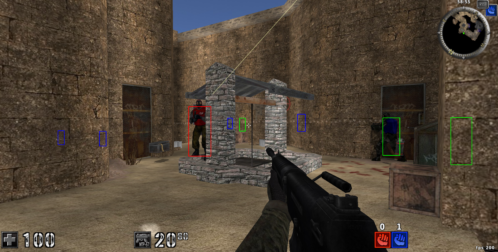

# hs-ac
#### Internal game hack for Assault Cube v1.3.0.2 on linux.

  

[Watch a video](https://www.youtube.com/watch?v=JZsfmOnBGMs)

This project is nothing but an experiment on learning the basics of reverse engineering and game hacking on linux, it is not intended to be commercialized in any way or used in the game's multiplayer matches.

## Cheats
- Hit-kill
- Invincibility
- Magnet
- Aimbot
- Triggerbot
- Sight-kill
- No Recoil
- No Spread
- No knockback
- Infinite ammo

You can enable specific cheats by setting their "modes" to the `GIMME` environment variable, or the second argument of the `run.sh` script.

## Setup
### Building
Enter `nix-shell` and run `./build.sh`, you can also just run `./build.sh` if you have the dependencies, this should produce two shared libraries: `libachook.so` and `hs-ac.so`.

`hs-ac.so` is the shared lib produced by Haskell, while `libachook.so` is produced by the C wrapper which uses `hs-ac.so` as an input.

### Running
Depending on your setup, you can run this from inside the `nix-shell` or outside of it if you have the `SDL` and `OpenGL` dependencies on your system.

To run, you should be at the root of this repo and call `./run.sh  <path-to-assaultcube.sh> <cheats-you-want>`.

The cheat uses the `LD_PRELOAD` technique to hook `SDL_GL_SwapWindow` from `libSDL`, and both `hs-ac.so` and `libachook.so` libs must be "findable" by your system, `run.sh` sets this up by appending `$PWD` to `LD_LIBRARY_PATH`. The script should work anywhere given the shared libs are in the same path as `run.sh`.

## Thanks
This project was heavily inspired by the [`Guided Hacking`](https://www.youtube.com/@GuidedHacking) yt channel, ever since I was a kid I wanted to create my own cheats thanks to this guy's videos, huge thanks to this legend and all the game hacking and reverse engineering community.

The inspiration for writing this cheat in Haskell and for the linux version came from [`scannells - ac_rhack`](https://github.com/scannells/ac_rhack) project, huge thanks to this guy for unknowingly planting this idea in my head.

Thank **you** for accessing this repo, I hope this inspires you to also **learn** the basics of reverse engineering and game hacking, it's actually way funnier and rewarding than you might expect.

# **This software contains no Assault Cube intellectual property and is not affiliated in any way.**